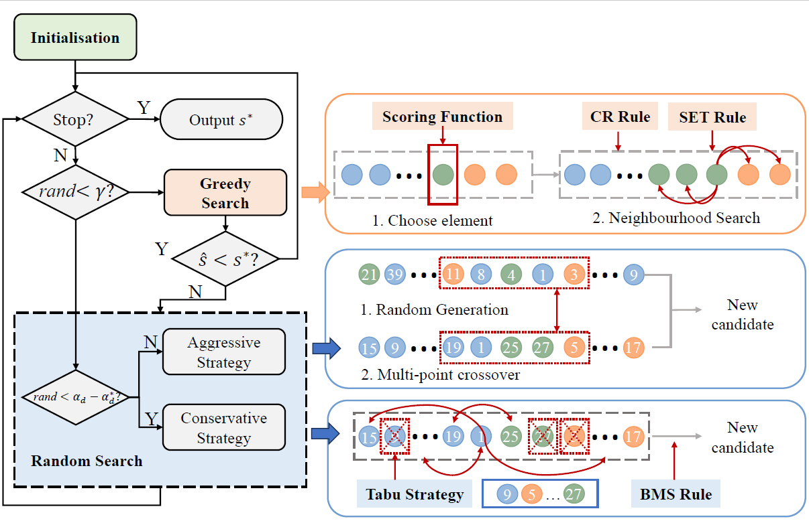
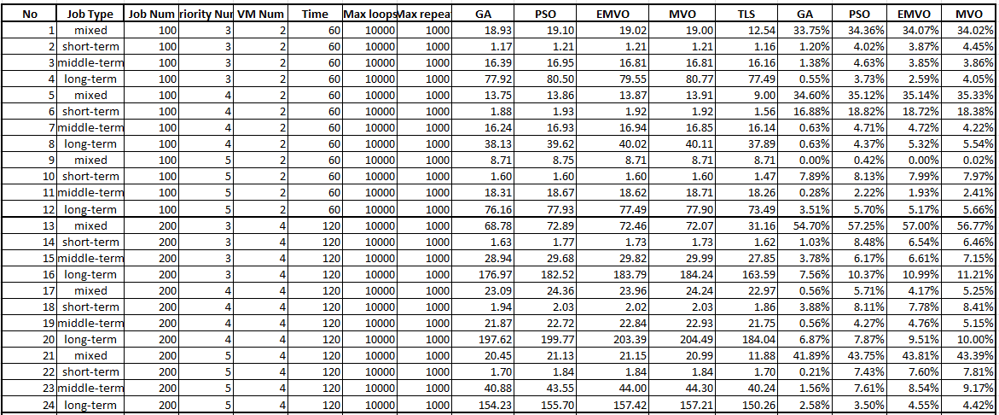
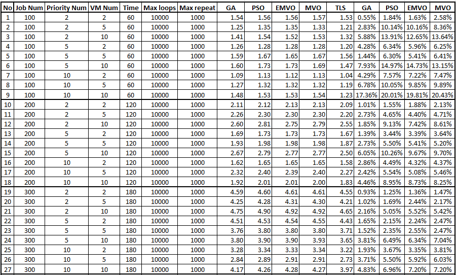
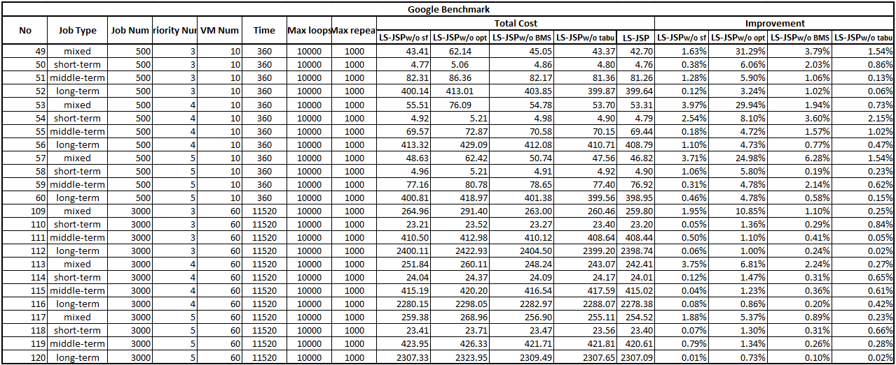
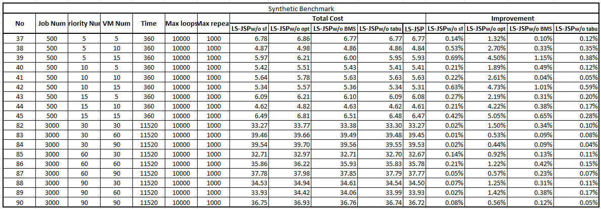

# LS-JSP
Repository for the paper: Effective Local Search for Priority-Constrained Job Scheduling in Cloud

Abstract: 
Job scheduling is crucial for optimising resource utilisation and cost in cloud computing, but it poses a significant challenge due to the heterogeneous nature of cloud resources and the increasing number of on-demand requests. 
We propose a novel local search-based job scheduling method, namely LS-JSP. LS-JSP considers resource
and priority constraints in cloud computing to jointly determine job assignment and processing sequence. Specifically, LS-JSP
incorporates a dynamic weighting scheme and a Tabu search strategy to optimise the scheduling solution. We conduct extensive
experiments on regular-scale and large-scale instances using Google and synthetic benchmarks. Our results demonstrate that LSJSP
can generate solutions with significantly lower costs than state-of-the-art baselines. 

This repository includes the implementation of LS-JSP and all experimental results (i.e., comparison experiments, ablation study, and parameter setting experiments).

The completed results are available in [Results](/Results).

The source code of LS-JSP and baseline algorithms are provided in [Source code](/Source_code/LS_Tabu_VMs).

## 1. Framework

 An overview of LS-JSP

In this paper, we propose a local-search-based algorithm, named LS-JSP, for solving the JSPRP in cloud computing. First, a set of solutions is generated randomly and then optimised by the proposed smallest left resources (SLR) rule in the initialisation phase. Then LS-JSP steps into the local search phase, taking the best solution $S$ from the solution set as the input. The local search phase works iteratively and contains a greedy and a random search mode to balance diversity and convergence.
## 2. Benchmark
To evaluate the performance of the proposed algorithm, we extract the real-world trace data as one benchmark (Google benchmark) and generate another based on it (synthetic benchmark).

We extract the information of jobs scheduled on the cloud from the first-day trace. The failed jobs and killed jobs are not considered in current research. The preprocessed data is provided in Dataset. Raw and preprocessed data are available at: <https://github.com/google/cluster-data>

We have 210 test instances, including 90 synthetic instances and 120 Google-based instances. Each algorithm is executed 10 times (replicates) for each instance. The average results are computed.

## 3. Results
To validate the performance of our LS-JSP algorithm, we compare it with four well-known algorithms, i.e., Genetic Algorithm (GA), Particle Swarm Optimisation Algorithm(PSO), Multi-verse Optimiser Algorithm (MVO) and Enhanced Multi-verse Optimiser Algorithm (EMVO). 

### 3.1 Comparison Experiments 

####  3.1.1 Results on Google Benchmark
The table shows the cost of the best solution found by all algorithms and the improvement LS-JSP algorithm achieves on the baseline algorithms. There are 120 instances and for the full results, please refer to [Results_google](/Results/Results%20on%20Google%20Benchmark.xlsx).

 The results of five algorithms on Google benchmark

####  3.1.2 Results on synthetic Benchmark
The table shows the cost of the best solution found by all algorithms and the improvement LS-JSP algorithm achieves on the baseline algorithms. There are 90 instances and for the full results, please refer to [Results_synthetic](/Results/Results%20on%20synthetic%20Benchmark.xlsx).

 The results of five algorithms on synthetic benchmark

### 3.2 Ablation Analysis

To evaluate the effectiveness of the core algorithmic techniques underlying LS-JSP, four variations of algorithms named  LS-JSPw/o sf, LS-JSPw/o opt, LS-JSPw/o BMS and LS-JSPw/o tabu are modified, which are the proposed LS-JSP without scoring function strategy, further optimisation search, BMS strategy, and tabu strategy, respectively. 

The comparison results the ablation study are given as follows.

 The results of ablation study on Google benchmark

 The results of ablation study on synthetic benchmark

### 3.3 Parameter Setting
We conduct the Taguchi method of design of experiment (DOE) to study the impacts of the parameters and choose the proper value of each parameter. We set five levels for each parameter, where γ = {0.01, 0.05, 0.1, 0.15, 0.2}, α∗d = {0, 0.1, 0.2, 0.3, 0.4}, σ = {100, 200, 300, 400, 500} and δ = {50, 100, 150, 200, 250}. 25 combinations of parameters are generated according to the Taguchi method and we test them on the same instance.

Same experiments are also conducted to baseline algorithms for parameter settings.

## 4. Reproducibility
### 4.1 Environment
We implement the proposed LS-JSP and all baselines in C++. All algorithms have the same coding mechanism, initial populations, and stopping criterion for fair comparisons. The experiments were conducted in the Microsoft Windows 11 OS with an Intel(R) Core(TM) i7-11700 CPU @2.50 GHz.

### 4.2 Parameter Setting
The Taguchi method of design of experiment (DOE) is conducted to set the parameters of all algorithms. Based on the experiments, the appropriate parameter combination of the LS-JSP is set as follows: γ = 0.1, α∗d = 0.4, δ = 200 and σ = 500. In GA, the cross probability is set as 0.5, and the mutation probability is 0.15. In PSO, four key parameters, including the weight, two learning factors, and the maximum velocity, are set as 0.6, 0.2, 0.8, and 1, respectively. In EMVO and MVO, the minimal wormhole existence probability is 0.2, the maximum wormhole existence probability is 1, and the exploitation accuracy is 4.

Parameters can be changed in <mark> base.h <mark>

### 4.2 Source code
For all the algorithms, there are three termination conditions: 1) the maximum computation time, 2) the maximum number of iterations, and 3) the maximum
repeat times of the best solution. In experiments, the maximum number of generations is set as 10000, and the maximum number of repeat times of the best solution is set as 1000. The maximum computation time is related to the number of jobs. The specific experiment settings for all instances is given in <em>ExperimentDesign.xlsx</em>

The termination conditions can be changed in <em>base.h</em>
